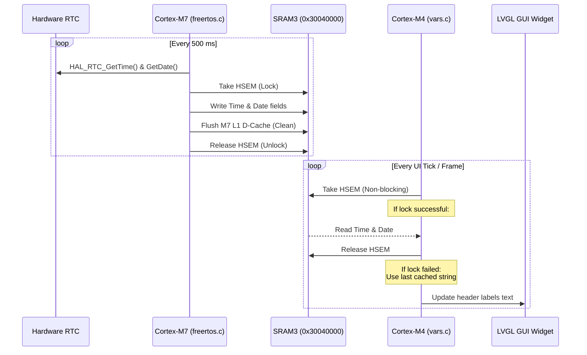

# Clock and RTC Architecture

This document describes the dual-core architecture used to manage, share, and display the real-time clock (RTC) date and time on the Central EMS panel.

---

## Architecture Overview

The system runs on an STM32H747 dual-core microcontroller:
1. **Cortex-M7 (Clock Writer)**: Runs FreeRTOS, handles low-level hardware interface (RTC), and writes live date/time parameters to a shared memory region.
2. **Cortex-M4 (Clock Reader & GUI)**: Runs the LVGL graphics stack and reads from the shared memory region to render the date and time on the screen.



---

## Core Components & Logic Location

### 1. The Shared Data Structure
* **File**: [shared_memory.h](file:///home/alex/Documents/PROJECTS/INVERTERS/InterpriseEnergySupply/CentralEMS/EMS_TWERD_APP/Common/shared_memory.h)
* **Description**: Defines `SharedBuffer_t` mapped to SRAM3 (`0x30040000`). SRAM3 is accessible by both cores.
* **Fields**:
  ```c
  uint8_t rtc_hours;
  uint8_t rtc_minutes;
  uint8_t rtc_seconds;
  uint8_t rtc_day;
  uint8_t rtc_month;
  uint16_t rtc_year;
  ```

---

### 2. Cortex-M7 writer task (Writer)
* **File**: [freertos.c](file:///home/alex/Documents/PROJECTS/INVERTERS/InterpriseEnergySupply/CentralEMS/EMS_TWERD_APP/CM7/Core/Src/freertos.c#L149-L180)
* **Description**:
  * FreeRTOS thread `StartDefaultTask` updates the clock every 500 ms.
  * Reads the hardware calendar shadow registers via `HAL_RTC_GetTime()` followed by `HAL_RTC_GetDate()`.
  * Locks the hardware semaphore (`HSEM_ID_SHARED_MEM` = 1) to prevent the M4 core from reading partially written data (tearing).
  * Writes the fields to `SHARED_BUFFER`.
  * **Cache Coherency**: Because the Cortex-M7 has L1 Cache enabled, it calls `SCB_CleanDCache_by_Addr()` to force-flush the cache line to physical SRAM3 memory.
  * Releases the semaphore.

---

### 3. Cortex-M4 UI Variables (Reader)
* **File**: [vars.c](file:///home/alex/Documents/PROJECTS/INVERTERS/InterpriseEnergySupply/CentralEMS/EMS_TWERD_APP/CM4/Core/Src/eez_ui/vars.c) (Automatically patched by [port_eez_ui.py](file:///home/alex/Documents/PROJECTS/INVERTERS/InterpriseEnergySupply/CentralEMS/EMS_TWERD_APP/port_eez_ui.py#L371))
* **Description**:
  * Implements `get_var_header_date()` and `get_var_header_time()`, which the LVGL rendering loop polls regularly to update the screen widgets.
  * Tries to take the HSEM lock non-blockingly: `HAL_HSEM_Take(HSEM_ID_SHARED_MEM, 0)`.
  * If successful, reads the RTC variables from SRAM3, formats them, and releases the HSEM lock.
  * If the lock fails (e.g. M7 is in the middle of a write), it simply returns the previously formatted string cache. This ensures the GUI rendering loop is non-blocking and never gets stuck.

---

### 4. PC Simulator Mode
* **File**: [vars.c](file:///home/alex/Documents/PROJECTS/INVERTERS/InterpriseEnergySupply/CentralEMS/EMS_TWERD_APP/CM4/Core/Src/eez_ui/vars.c#L28-L36) (inside `#else` block)
* **Description**:
  * When compiling for the host computer (`PC_SIMULATOR` build definition is set), it bypasses STM32 hardware calls and directly queries standard C library `time()` and `localtime()` to show the active host system time.

---

## Maintenance & UI Code Generation

`vars.c` is generated from EEZ Studio. To prevent manual edits from being overwritten when exporting a new UI:
* The sync script [port_eez_ui.py](file:///home/alex/Documents/PROJECTS/INVERTERS/InterpriseEnergySupply/CentralEMS/EMS_TWERD_APP/port_eez_ui.py) contains a patch rule that intercepts `vars.c` and replaces the EEZ-generated stubs with the dual-core RTC logic.
* **Keep all edits to the RTC logic inside [port_eez_ui.py](file:///home/alex/Documents/PROJECTS/INVERTERS/InterpriseEnergySupply/CentralEMS/EMS_TWERD_APP/port_eez_ui.py)**.
