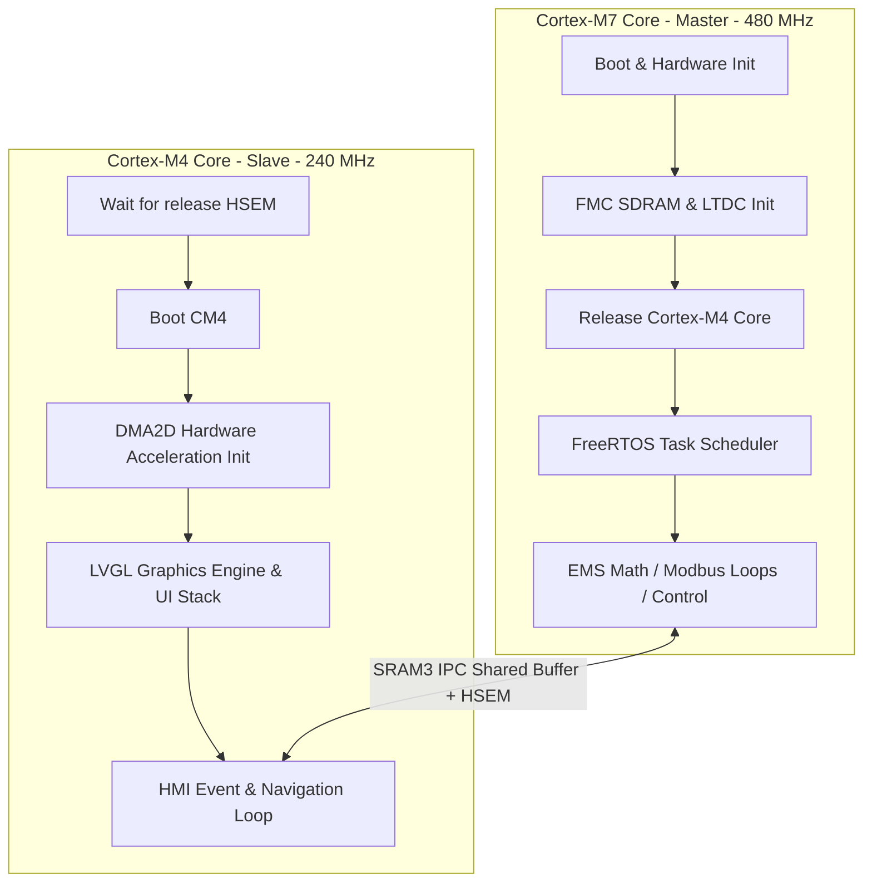
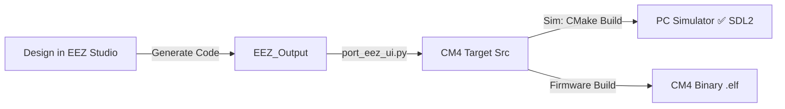

# Central Energy Management System (EMS) HMI Firmware Project

This repository houses the firmware and visual HMI design for the **Central Energy Management System (EMS)**, designed for the **Riverdi 7.0” STM32 Embedded Display** (powered by the dual-core **STM32H757XIH6** MCU, asymmetric Cortex-M7 + Cortex-M4 architecture).

It is a fully decoupled **Dual-Core HMI template project** utilizing:
- **Cortex-M7 (480 MHz Master)**: Executes real-time calculations, FreeRTOS tasks, Modbus TCP/RTU communications, and background microgrid control loops.
- **Cortex-M4 (240 MHz Slave)**: Runs the dedicated HMI graphics engine using **LVGL v8**, hardware-accelerated **DMA2D (Chrom-ART)** upscaling, and user interaction logic.

---

## 🏗️ Dual-Core Decoupled HMI Architecture

To guarantee deterministic timing for critical grid calculations and Modbus control loops, HMI rendering is completely offloaded to the Cortex-M4 core. 



### 1. Master Core: Cortex-M7 (CM7)
- Controls the system boot sequence, power domains, and clocks.
- Configures and opens access to external hardware memory resources including the **FMC SDRAM Controller** and **LTDC Display Controller**.
- Coordinates synchronization: Keeps the CM4 core in deep sleep until the external SDRAM interface is fully initialized, preventing memory bus contentions.
- Runs **FreeRTOS** tasks for zero-export control loops, frequency shifting curves, Modbus RTU/TCP polling of inverters, meters, and static transfer switches (STS).

### 2. Slave Core: Cortex-M4 (CM4)
- Boots up when released by the CM7 after SDRAM is operational.
- Configures **DMA2D (Chrom-ART)** for high-speed hardware-accelerated color upscaling, canvas flushing, and blitting.
- Runs the **LVGL v8** graphical framework, rendering the HMI screens and managing matrix keypad input navigation.

### 3. Inter-Processor Communication (IPC)
- **Shared SRAM3 (`0x30040000`)**: Telemetry parameters (read-only on CM4) and configuration settings (read-write on CM4) are synchronized via a shared memory structure defined in [Common/shared_memory.h](Common/shared_memory.h).
- **Hardware Semaphores (`HSEM`)**: Prevent concurrency issues when both cores access the shared buffer (`HSEM_ID_SHARED_MEM` / Semaphore ID 1).

---

## ⚙️ Display & UI Specifications

The screen is a non-touch model operated via **six physical navigation buttons** (UP, DOWN, LEFT, RIGHT, ENTER, BACK). High-contrast focus outlines and structured key event handlers are mapped to support fully remote non-touch operation.

| Component | Specification | Details |
|---|---|---|
| **MCU** | STM32H757XIH6 | Dual-core: Cortex-M7 (480MHz) + Cortex-M4 (240MHz) |
| **RAM** | 9 MB | 1 MB internal SRAM + 8 MB external SDRAM (32-bit width) |
| **Display Panel** | 7.0" IPS TFT LCD | Resolution: **1024x600**, 170 DPI, 24-bit RGB888 |
| **LVGL Buffer** | 16-bit RGB565 | Drawn by CM4 into internal SRAM and upscaled by DMA2D to ARGB8888 |
| **Touch Pad** | None | Touch driver is disabled; optimized for physical buttons |
| **Target Panels** | Riverdi Non-touch | Models: `RVT70HSSFWN00` / `RVT70HSSNWN00` |

---

## 🛠️ Main Features Implemented

### 1. Dynamic Translation Engine (i18n)
- Declared in [EEZ_Output/ui_translate.h](EEZ_Output/ui_translate.h) and defined in [EEZ_Output/ui_translate.c](EEZ_Output/ui_translate.c).
- Supports runtime language switching between **Polish (PL)**, **English (EN)**, and **Ukrainian (UA)**.
- Localizes all sidebar menus, tab view titles, and modal prompts dynamically on the fly with a ROM-based lookup map (zero-RAM footprint).
- Automatically translates calendar date abbreviations and weekday strings mapped from shared RTC variables.
- Dynamically translates active login roles in the top header bar (e.g. `Guest` -> `Gość` / `Гість`).

### 2. Custom Multi-Language Fonts (Cyrillic + Polish)
- Overridden standard Montserrat fonts to support Unicode Latin Extended-A and Cyrillic character ranges (`0x0100-0x017F` and `0x0400-0x04FF`).
- Fonts were converted with `--no-compress` to output raw bitmap arrays, resolving rendering issues when combined with standard styles.
- Built-in fonts are deactivated in [Middlewares/Third_Party/lvgl/lv_conf.h](Middlewares/Third_Party/lvgl/lv_conf.h) and remapped to the custom font descriptors:
  - `EEZ_Output/ui_font_montserrat_14.c` (~239KB)
  - `EEZ_Output/ui_font_montserrat_16.c` (~280KB)

### 3. Focus & Recolor Styling Corrections
- Disabled recoloring transparency filters (`recolor_opa = 0`) on the Central EMS label image widget (`control-system-label-alpha`) in [EEZ/Riverdi-template/src/ui/screens.c](EEZ/Riverdi-template/src/ui/screens.c) and [EEZ_Output/screens.c](EEZ_Output/screens.c) to restore its native steel-blue/gray palette gradient.
- Remapped the key focus states on `objects.login_btn` to match the sidebar menu navigation buttons, ensuring uniform border highlighting when navigating via the keypad.
- Corrected the login button child mapping so that text state updates don't overwrite the icon label (which must remain as `"1"`).

---

## 🚀 Integrated Build & Flashing Pipeline



### 1. Generating UI from EEZ Studio
1. Open the project visual HMI file: [EEZ/Riverdi-template/Riverdi-template.eez-project](EEZ/Riverdi-template/Riverdi-template.eez-project).
2. Design widgets, layouts, and variables inside EEZ Studio.
3. Export the code into `EEZ_Output`.
4. Run the sync script to format, patch, and copy files to the CM4 firmware source tree:
   ```bash
   python3 port_eez_ui.py
   ```

### 2. Building and Running the PC Simulator
You can iterate on HMI layout changes on a Linux host using the SDL2 simulator:
```bash
# Compile the SDL2 Simulator executable inside Docker builder
docker compose run --rm builder bash -c \
    'cmake -B pc_simulator/build -S pc_simulator && make -C pc_simulator/build -j$(nproc)'

# Run the simulator natively on the host display
./pc_simulator/build/lvgl_simulator
```

### 3. Compiling the STM32H7 Firmware
Both core binaries are compiled inside the Docker builder container:
```bash
# Clean previous build artifacts
docker compose run --rm builder make clean

# Compile CM4 HMI Firmware
docker compose run --rm builder make cm4

# Compile CM7 System Firmware
docker compose run --rm builder make cm7

# Compile both cores simultaneously
docker compose run --rm builder make all
```

### 4. Flashing the Dual-Core Board
Connect your debug probe (ST-LINK) to the display board and flash the binaries using `STM32_Programmer_CLI`:
```bash
# Flash Cortex-M7 Core (Flash Bank 1)
STM32_Programmer_CLI -c port=SWD -w STM32CubeIDE/CM7/Release/riverdi-70-stm32h7-lvgl_CM7.elf -rst

# Flash Cortex-M4 Core (Flash Bank 2)
STM32_Programmer_CLI -c port=SWD -w STM32CubeIDE/CM4/Release/riverdi-70-stm32h7-lvgl_CM4.elf -rst
```

---

## 📁 Directory Layout

- **[CM4/](CM4)**: Cortex-M4 C Source Code (dedicated graphics engine loop).
  - **[CM4/Core/Src/eez_ui/](CM4/Core/Src/eez_ui)**: Target directory for ported HMI screens, images, translations, and font tables.
- **[CM7/](CM7)**: Cortex-M7 C Source Code (Modbus telemetry tasks, FreeRTOS control loops).
- **[Common/](Common)**: IPC structures shared between cores.
  - **[Common/shared_memory.h](Common/shared_memory.h)**: Shared memory buffer mapping layout.
- **[EEZ/](EEZ)**: EEZ Studio workspace visual project configurations.
- **[EEZ_Output/](EEZ_Output)**: Export folder from EEZ Studio.
- **[pc_simulator/](pc_simulator)**: SDL2 simulation framework configuration for x86_64 hosts.

---

## 📖 Associated Guides & Specifications
For parent system specifications and detailed design requirements, refer to:
* **[ui_requirements.md](../ui_requirements.md)**: Main UI spec (non-touch navigation rules, parameters list, STS cabinet states, active power flow directions).
* **[parameters.json](../parameters.json)**: Machine configurations and scaling metrics.
* **[parameters_description_en.md](../parameters_description_en.md)**: Detailed documentation of EMS Modbus registers.
* **[architecture_diagram.md](../architecture_diagram.md)**: MVC model synchronization design summary.
